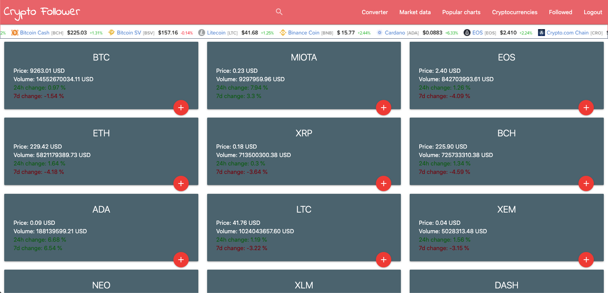
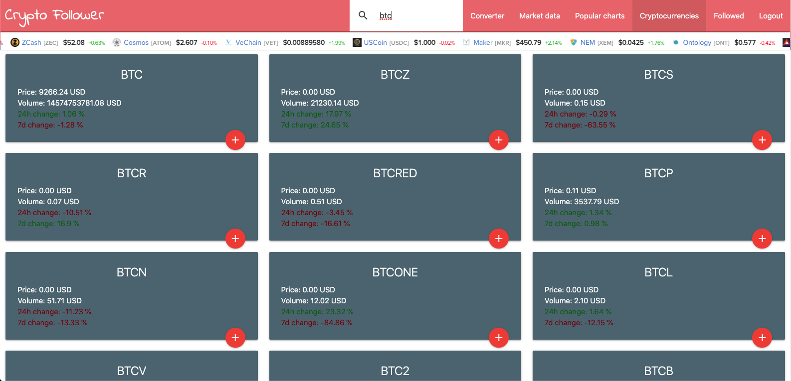
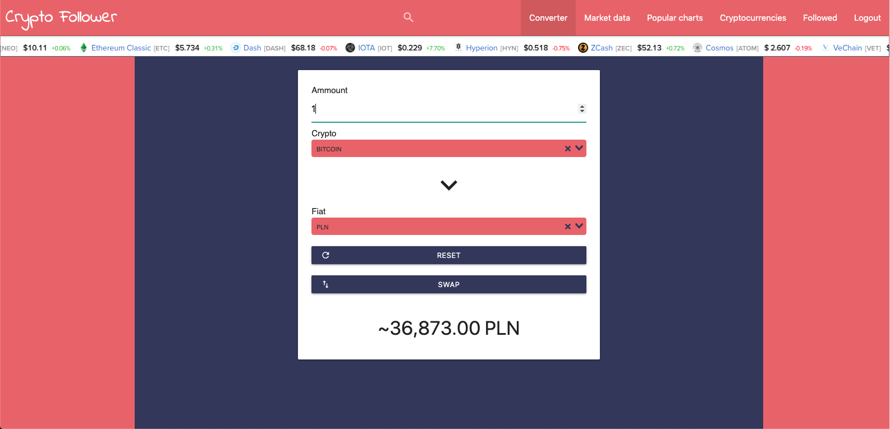

# Crypto Follower
> Web application that allows you to be up to date with current cryptocurrency prices.

## Table of contents
* [Screenshots](#screenshots)
* [Technologies](#technologies)
* [Setup](#setup)
* [Features](#features)
* [Contact](#contact)

## Screenshots

## Technologies
* Django - version 3.07
* Django Rest Framework - version 3.9.3
* Vue - version 2.6.11

## Setup
1. Clone repository `git clone`

2. Install Django dependencies `pip install -r requirements.txt`

3. Install Vue dependencies `npm install`

4. Make migrations `python manage.py makemigrations`

5. Migrate `python manage.py migrate`

6. Run Django server `python manage.py runserver`

7. Run Vue app `npm run serve`

## Features

* Current cryptocurrency prices
* Possibility to follow only specific cryptocurrency
* Price converter with all cryptocurrencies and many fiats

## Contact
Created by [@szafran98](http://szafranowski.com.pl//) - feel free to contact me!
